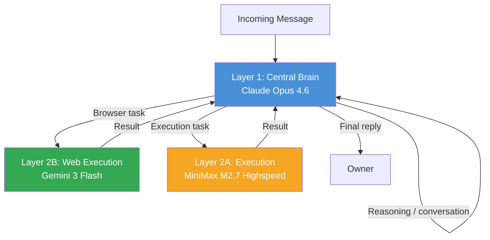
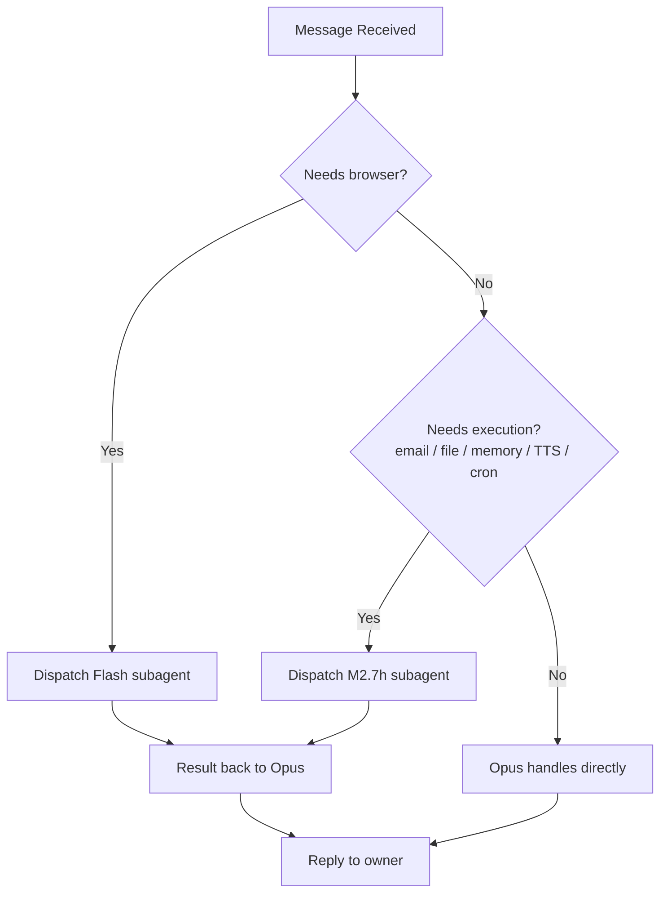
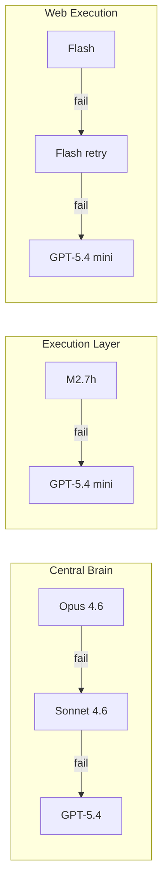

# SoulFirst — Model Routing Architecture

> A three-layer intelligent routing system for multi-model AI agents.

---

## Overview

SoulFirst uses a **three-layer model architecture** designed for cost efficiency, task specialization, and reliable failover. Each layer has a distinct role: reasoning, execution, and web interaction.

---

## Layer Descriptions

### Layer 1 — Central Brain: Claude Opus 4.6

**Model:** `claude-opus-4-6` | **Role:** Primary handler (default)

The Central Brain is the **sole entry point** for all incoming messages. It owns all reasoning, planning, and decision-making.

**Handles directly:**
- All conversation, Q&A, casual chat
- Complex reasoning, planning, and strategy
- Code writing, review, and architecture design
- Legal, tax, compliance, and policy decisions
- Irreversible decisions (external communications, business risk)
- Task decomposition and subagent dispatching

**Hard constraint:** Opus **never** invokes `browser` or `canvas` tools. Any web-facing task is delegated.

---

### Layer 2A — Execution: MiniMax M2.7 Highspeed

**Model:** `m27h` (MiniMax M2.7 Highspeed) | **Dispatched via:** `sessions_spawn`

Opus's "hands" — executes concrete operational tasks so reasoning capacity stays focused.

**Five execution domains:**

| Domain | Description |
|--------|-------------|
| **Email & Communication** | Inbox search, email drafting, sending |
| **File & Data Analysis** | Local files, Drive docs, data cleaning, summaries |
| **Memory Maintenance** | Daily notes, long-term memory updates |
| **TTS Voice** | Receives text from Opus → calls TTS API → plays audio |
| **Cron Scheduled Tasks** | Periodic background jobs |

---

### Layer 2B — Web Execution: Gemini 3 Flash

**Model:** `flash` (Gemini 3 Flash) | **Dispatched via:** `sessions_spawn`

**Dedicated browser operator.** Handles all tasks requiring web interaction.

**Handles:**
- Web automation and scraping
- UI interactions (clicks, filters, form fills)
- Dynamic page data extraction
- High-frequency web operations

---

## Routing Priority

When a message arrives, Opus determines routing by priority:

| Priority | Condition | Route |
|----------|-----------|-------|
| **P0** | Browser or canvas operation | → Gemini Flash subagent |
| **P1** | Email, file, memory, TTS, or cron | → M2.7h subagent |
| **P2** | Reasoning, code, legal, or design | → Opus (direct) |
| **P3** | Daily conversation, Q&A | → Opus (direct) |

---

## Decision Flowchart

---

## Failover Chain

Each layer has a defined fallback path to ensure resilience.

---

## Heartbeat System

**Schedule:** Every 15 minutes

**Purpose:** Lightweight health check to maintain system availability.

**Cost efficiency:** Uses standard MiniMax M2.7 (not highspeed variant) to minimize cost during routine checks.

Heartbeat tasks are minimal — no heavy reasoning, just a status ping to confirm all layers are reachable.

---

## Absolute Rules

> ⚠️ **Hard constraint:** Opus never calls `browser` or `canvas` tools under any circumstances.
>
> Any web-facing task detected in the Central Brain must be immediately delegated to a Flash subagent. Violation of this rule is treated as a system fault.

---

## Batch Web Task Protocol

For high-volume web automation:

- **Mandatory task splitting:** Long sequences are broken into single-target micro-tasks
- **Queue control:** Concurrency capped at `subagents.maxConcurrent: 8`
- **No bulk retry:** Each micro-task is independently retried; failures don't re-run the full batch
- **Explicit model declaration:** Always pass `model: "flash"` when spawning web subagents

---

## Summary

| Layer | Model | Role | Called by |
|-------|-------|------|-----------|
| 1 | Opus 4.6 | Central brain, reasoning, dispatch | Direct (entry) |
| 2A | M2.7h | Email, files, memory, TTS, cron | Opus spawns |
| 2B | Flash | Browser automation | Opus spawns |

This architecture keeps the reasoning model focused while distributing operational load to cost-efficient, specialized execution agents.
