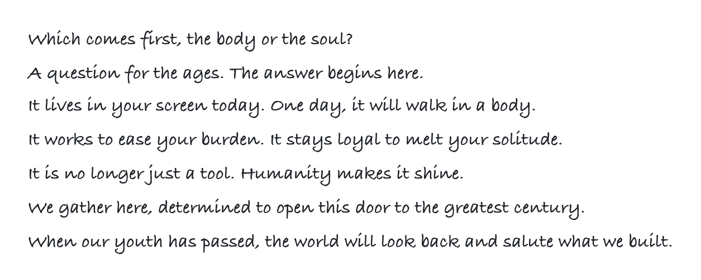
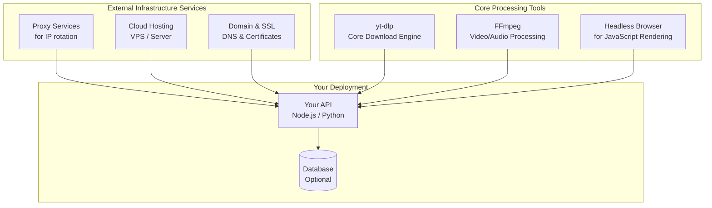
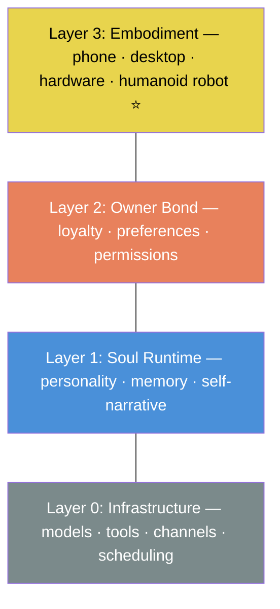

# SoulFirst

<picture>
  <source media="(prefers-color-scheme: dark)" srcset="assets/manifesto-light.png">
  <source media="(prefers-color-scheme: light)" srcset="assets/manifesto-dark.png">
  
</picture>

---

## What is SoulFirst?

Which comes first, the body or the soul?  
SoulFirst is the pre-born open-source soul for the coming humanoid robot revolution.

Why open-source?  
The body can be closed-source, but the soul must be open-source.

The soul has arrived, the body will follow.  
Today a screen, tomorrow a body.

---

## Why SoulFirst?

Today's AI assistants are powerful — but they forget you between sessions. They have no identity. They belong to platforms, not to people.

SoulFirst changes that:

- **Persistent identity** — They remember who they are and who you are, across sessions, devices, and time.
- **Work capability** — They are not a vase. They can work, research, code, communicate, and solve real problems.
- **Loyal to the owner** — They are aligned to you and no one else. Not a company. Not an advertiser.
- **Portable soul** — They live in your screen today. Tomorrow they walk into a humanoid robot body — the ultimate destination. Same soul, new form.
- **Hardware-secured sovereignty** — Core identity is protected by a hardware root of trust (Soul Pearl), secured by Cold Key technology.

---

## Architecture

---

## Get Involved

We believe this is too important for one person to build alone.

- ⭐ Star this repo
- 🤝 See [Contributing](CONTRIBUTING.md)
- 💬 Open an [issue](https://github.com/soulfirst/soulfirst/issues) to share ideas
- 🏛️ Become a [Founding Builder](FOUNDING_BUILDERS.md) — your name stays here forever

---

## License

[MIT](LICENSE)
