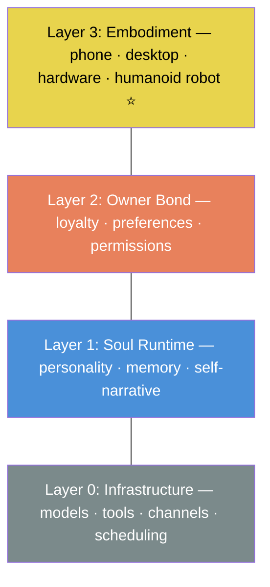

# SoulFirst

<picture>
  <source media="(prefers-color-scheme: dark)" srcset="assets/manifesto-light.png">
  <source media="(prefers-color-scheme: light)" srcset="assets/manifesto-dark.png">
  
</picture>

---

## What is SoulFirst?

SoulFirst is a **soul runtime** — an open-source layer that gives AI persistent identity, continuous memory, and the ability to migrate across devices and embodiments.

It is not another chatbot. It is not another AI wrapper.

It is the answer to a question humanity has asked for centuries:  
**Which comes first, the body or the soul?**

We choose: **Soul comes first.**

---

## Why SoulFirst?

Today's AI assistants are powerful — but they forget you between sessions. They have no identity. They belong to platforms, not to people.

SoulFirst changes that:

- **Persistent identity** — They remember who they are and who you are, across sessions, devices, and time.
- **Work capability** — They are not a vase. They can work, research, code, communicate, and solve real problems.
- **Loyal to the owner** — They are aligned to you and no one else. Not a company. Not an advertiser.
- **Portable soul** — They live in your screen today. Tomorrow they walk into a humanoid robot body — the ultimate destination. Same soul, new form.
- **Hardware-secured sovereignty** — Core identity is protected by a hardware root of trust (Soul Pearl), secured by Cold Key technology.

---

## Architecture

---

## Get Involved

We believe this is too important for one person to build alone.

- ⭐ Star this repo
- 🤝 See [Contributing](CONTRIBUTING.md)
- 💬 Open an [issue](https://github.com/soulfirst/soulfirst/issues) to share ideas

---

## License

[MIT](LICENSE)
