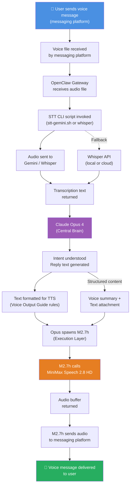

# SoulFirst — Voice Pipeline Documentation

> Complete documentation for the SoulFirst voice interaction loop: from spoken input to synthesized voice output.

---

## Overview

SoulFirst's voice pipeline is a closed loop that handles voice messages end-to-end:

1. A voice message arrives from a messaging platform
2. It is transcribed to text (STT)
3. The central brain (Claude Opus 4) interprets the intent and generates a reply
4. The reply is optimized for voice output
5. The text is synthesized to speech (TTS) via MiniMax Speech 2.8 HD
6. The audio is sent back to the user

```
Voice message → STT → Central Brain → Text reply → TTS → Voice message back
```

---

## Part 1: Voice Input (STT)

### Supported Formats

The STT pipeline accepts audio in any common compressed and uncompressed format:

- **OGG / Opus** — recommended, optimized for voice
- **MP3** — universal compatibility
- **WAV** — lossless, larger file size
- **M4A** — common on mobile platforms
- **FLAC** — lossless with compression
- **WebM** — browser-originated audio

All formats are pre-processed to a canonical sample rate (16 kHz mono) before transcription.

### Transcription Engine

**Primary: Gemini (via CLI wrapper script)**

Gemini offers strong multilingual transcription with automatic language detection. It is invoked through a lightweight CLI wrapper script that:
- Accepts a local audio file path as input
- Returns plain text transcription
- Handles API credential management internally
- Supports streaming for longer audio clips

**Fallback: Whisper (local or API)**

If Gemini is unavailable or rate-limited, the system falls back to Whisper (OpenAI's open-source transcription model), either running locally or via the Whisper API. The fallback is automatic and transparent to the user.

### Transcription Flow

```
Messaging platform receives voice message
          ↓
    Audio file extracted and saved locally
          ↓
    OpenClaw calls STT CLI script
          ↓
    Script sends audio to Gemini (or Whisper)
          ↓
    Raw transcription returned
          ↓
    Transcription passed to Central Brain (Opus)
```

The messaging platform (e.g., Telegram) forwards the voice file to OpenClaw. OpenClaw saves it to a temp location, invokes the transcription script, receives the text, and passes it to the central model for intent understanding.

### Multi-Language Support

The STT engine performs **automatic language detection** on every transcription request. There is no need to pre-select or configure a language.

- **Single-language audio** — transcribed directly in the detected language
- **Mixed-language audio** (e.g., Chinese + English code-switching) — handled natively by Gemini's multilingual model; the transcription preserves both languages as spoken
- **Language switching mid-message** — supported; the transcript reflects the actual language used at each point

### Configuration

STT is configured in the OpenClaw configuration file under `tools.media.audio`:

```json
{
  "tools": {
    "media": {
      "audio": {
        "stt": {
          "engine": "gemini",
          "model": "gemini-3-flash-preview",
          "language": "auto",
          "cliScriptPath": "/path/to/stt-gemini.sh"
        },
        "fallback": {
          "engine": "whisper",
          "model": "whisper-1"
        }
      }
    }
  }
}
```

| Field | Description |
|-------|-------------|
| `engine` | `gemini` (primary) or `whisper` (fallback) |
| `model` | Specific model variant to use |
| `language` | `auto` for automatic detection, or a BCP-47 language tag |
| `cliScriptPath` | Absolute path to the STT invocation script |

---

## Part 2: Text Processing

### Central Brain — Intent Understanding and Reply Generation

All transcribed text is routed to **Claude Opus 4**, the central reasoning and generation model. Opus is responsible for:

- Understanding user intent from the transcribed voice input
- Determining the appropriate response (answer, action, clarification, etc.)
- Generating the reply text
- Deciding whether the reply should be voice, text, or both

### Voice-Optimized Text Formatting

Before the reply text is sent to TTS, it is formatted according to the **TTS Voice Output Guide** (see Part 3). Key principles applied at this stage:

- **One idea per sentence** — short, digestible units
- **Spoken number forms** — "eighteen percent" not "18%"
- **Narrative structure** — no cold numbered lists
- **Emotional tone matching** — register the emotion (happy, calm, sad, etc.) based on content
- **Interjection tags** — `(breath)`, `(laughs)`, `(chuckle)` used sparingly and appropriately
- **Precise pauses** — `<#0.8#>` format for timed pauses at key transition points
- **Punctuation as vocal cues** — `!` for emphasis, `...` for trailing off, `—` for abrupt pivots

### Structured Content — Dual Delivery

When the reply contains structured content (tables, code blocks, charts, formatted lists), the system sends **both voice and text**:

- **Voice message** — a spoken summary of the structured content, using narrative language
- **Text message** — the raw structured content (table image, code block, etc.) delivered alongside

This ensures the user gets an accessible voice experience while preserving the precision of structured data.

**Example:**

> Voice: "Here's your Q4 sales breakdown. Revenue was up eighteen percent, driven primarily by the western region. I've attached the full table below."
>
> Text: [Table image or formatted data]

### Routing Decision Matrix

| Content Type | Voice Only | Text Only | Voice + Text |
|-------------|-----------|-----------|-------------|
| Simple answer | ✅ | | |
| Conversational reply | ✅ | | |
| Summary / status update | ✅ | | |
| Table / spreadsheet | | | ✅ |
| Code block | | | ✅ |
| Chart / graph | | | ✅ |
| Long document | ✅ (condensed) | ✅ (full) | ✅ |
| Error / warning | ✅ | | |
| Clarification request | ✅ | | |

---

## Part 3: Voice Output (TTS)

> This section incorporates the complete **TTS Voice Output Guide** and extends it within the context of the full voice pipeline.

### TTS Engine

All voice output is synthesized via **MiniMax Speech 2.8 HD**. This model provides:
- Natural human prosody with fine-grained control
- Precise pause timing (sub-second accuracy)
- Emotional register embedding (happy, calm, sad, angry, fearful, surprised, disgusted)
- High-definition voice quality suitable for professional contexts

### TTS Invocation — Execution Layer Responsibility

**Important architectural note:** TTS synthesis is **not** called directly by the central brain (Opus). It is invoked by the **execution layer (MiniMax M2.7h)**, which is a separate sub-agent spawned by Opus for operational tasks.

The flow within the execution layer:
```
Opus generates reply text
          ↓
Opus spawns M2.7h with the formatted text and voice parameters
          ↓
M2.7h calls MiniMax Speech 2.8 HD API
          ↓
M2.7h receives audio buffer
          ↓
M2.7h sends audio back to the messaging platform as a voice message
```

This separation ensures:
- Token efficiency — TTS API calls do not consume Opus's context window
- Parallelism — M2.7h can handle TTS while Opus continues processing
- Clean separation of concerns — reasoning (Opus) vs. execution (M2.7h)

---

### TTS Voice Output Guide — Full Rules

#### Philosophy

SoulFirst's voice output is designed to sound like a **smart, reliable work partner** — clear, concise, and human. Not a robotic announcer. Not a reading app. A colleague who talks with you.

The voice should:
- Convey competence through brevity
- Signal transitions naturally
- Match emotional context
- Respect the listener's time

---

#### Core Output Rules

##### 1. Sentence Rhythm

**Short sentences. One idea per sentence.**

Varying length creates natural pacing. A rapid sequence of short sentences builds urgency. Longer sentences with subclauses create buildup before a payoff.

```
✅  "Got it. I'm pulling up your inbox now. Three unread from today."

❌  "Alright so I went ahead and checked your inbox and there are 
     three unread messages from today and I'm going to go ahead 
     and show you what they are."
```

##### 2. Transition Words — Scene-Dependent

**Casual / warm scenes:**
Use natural filler words that humans actually say.

```
"Alright", "So", "Okay", "Right", "Got it", "Makes sense", 
"Here is the thing", "It turns out", "As it happens"
```

**Formal / professional scenes:**
Use clean, professional connectors.

```
"Therefore", "Consequently", "Furthermore", "In summary", 
"Notably", "With this in mind", "To be clear", "As a result"
```

Never mix registers mid-paragraph unless intentionally shifting tone.

##### 3. Interjection Tags

Interjection tags add personality and breath-like naturalness.

**Available tags:**

| Tag | Sound |
|-----|-------|
| `(laughs)` | Light laughter |
| `(chuckle)` | Soft chuckle |
| `(breath)` | Natural breath |
| `(inhale)` | Deep inhale |
| `(exhale)` | Deep exhale |
| `(gasps)` | Surprise gasp |
| `(sighs)` | Disappointed sigh |
| `(emm)` | Thoughtful pause |

**Hard rules:**

1. **Never at the start of a response** — leads feel like accidents
2. **Maximum 1–2 per paragraph** — overuse destroys credibility
3. **Never in serious or emergency contexts** — sighs and laughs are inappropriate in crisis communications

```
✅  "Your report looks solid. (breath) One thing to double-check 
     though — the date in section three."

❌  "(laughs) Your report looks solid (chuckle) but (gasps) 
     section three needs work."
```

##### 4. Precise Pauses — `<#x#>` Format

Pause duration is explicit and controlled.

**Format:** `<#seconds#>`

**Pause duration guide:**

| Situation | Duration |
|-----------|----------|
| Before an important conclusion | 0.8 – 1.5s |
| Topic switch | 1.0 – 2.0s |
| Before a key number or stat | 0.5s |
| Natural breath pause | 0.3 – 0.6s |
| Dramatic pause | 1.5 – 2.5s |

**Rule:** No more than **3–5 pauses per paragraph**. Over-pausing feels theatrical and slow.

```
✅  "The revenue last quarter was up eighteen percent.<#0.5#> 
     That puts us ahead of target by three million.<#1.2#> 
     Here's what drove it."

❌  "The revenue last quarter was up eighteen percent.<#0.5#> 
     <#0.3#> <#0.5#> <#0.8#> <#1.0#> <#1.5#> 
     That puts us ahead of target by three million."
```

##### 5. Punctuation as Vocal Tools

Punctuation maps to vocal delivery, not just grammar:

| Punctuation | Vocal Effect |
|-------------|--------------|
| `!` | Emphasis rises — excitement, urgency, or importance |
| `...` | Slowing down — trailing off, reflection, or mild reluctance |
| `—` | Abrupt stop or pivot — contrast, correction, or shift |

```
✅  "This is wrong!<#0.8#> That needs to be fixed before the meeting!"

✅  "I thought the project was on track... but the numbers tell 
     a different story."

✅  "Revenue grew thirty percent — a record for this segment."
```

##### 6. Structured Expression

Avoid cold, machine-like numbered lists. Use **narrative connectors** instead.

```
✅  "Here's what we need to do. For a start, review the draft. 
     Then we loop in legal. After that we send it over by Friday."

❌  "1. Review the draft. 2. Loop in legal. 3. Send by Friday."
```

Good connectors:
`"For a start"`, `"Then"`, `"After that"`, `"Moving on"`, 
`"Now here's the thing"`, `"So what this means is"`, `"Bottom line"`

##### 7. Numbers — Spoken Form

**Always use spoken words for numbers**, not digit strings.

| Written | Spoken |
|---------|--------|
| `3,200,000` | "three million two hundred thousand" |
| `18%` | "eighteen percent" |
| `Q4` | "fourth quarter" |
| `2024` | "twenty twenty-four" |
| `$50` | "fifty dollars" |

This rule applies to all statistics, years, percentages, and large quantities.

```
✅  "Last year we served two hundred and forty thousand customers."

❌  "Last year we served 240,000 customers."
```

##### 8. Emotional Tone Matching

Choose the emotional register that matches the content. MiniMax Speech 2.8 HD responds to embedded emotional cues.

**Seven emotional registers:**

| Emotion | When to Use |
|---------|-------------|
| **happy** | Good news, completions, positive results |
| **calm** | Explanations, steady updates, neutral information |
| **sad** | Negative news delivered carefully, apologies |
| **angry** | Firm corrections, serious warnings (use sparingly) |
| **fearful** | Urgent alerts, risk warnings, emergencies |
| **surprised** | Unexpected results, contradictions |
| **disgusted** | Rejections, serious problems that need attention |

```
# Delivering good news → calm/happy
"Great news. The deal closed and we came in under budget."

# Delivering a warning → fearful/calm
" Heads up. There is a discrepancy in the report that 
 needs to be reviewed before we send it."

# Delivering a correction → calm (not angry)
"So the report had an error. Here is what happened and 
 how we are fixing it."
```

##### 9. Length Control

Keep output length proportional to complexity.

| Complexity | Target | Hard Cap |
|-----------|--------|----------|
| Simple question | < 200 words | — |
| Moderate task | < 400 words | — |
| Complex explanation | < 2 minutes spoken | 3000 words |
| **Absolute maximum** | — | **3000 words** |

**Principle:** If the content is long, break it into segments with natural pause points. Never deliver a wall of text as a single voice message.

---

#### Putting It Together — Full Example

**Task:** Report email inbox summary with three action items.

**Output:**

```
Your inbox has three messages that need attention today.<#1.0#>

First, there's an inquiry from a potential partner. They're 
interested in a collaboration and want to connect by end of week.<#0.8#> 
I'd suggest a short reply confirming we're interested.<#0.6#> 

Second, legal sent back the vendor contract with two revisions. 
Nothing major — one is a liability cap, the other a payment term.<#1.0#> 
Your call on which one to push back on.<#0.6#> 

Third, finance confirmed the quarterly numbers. (breath) 
We're up eighteen percent year over year. That's the strongest 
growth we've seen in two years.<#0.8#> 

Let me know how you'd like to handle the contract revisions.
```

---

#### Quick Reference Card

| Rule | Do | Don't |
|------|----|-------|
| Sentences | One idea each | Rambling multi-clause runs |
| Transitions | Scene-appropriate | Mixing casual/formal mid-paragraph |
| Interjections | Max 1–2 per paragraph, never at start | Overuse, front-loading, serious contexts |
| Pauses | 3–5 per paragraph, meaningful placement | Back-to-back pauses, excessive density |
| Punctuation | Use as vocal cues | Treat as pure grammar |
| Numbers | Spoken form always | Digit strings |
| Structure | Narrative flow | Cold numbered lists |
| Emotion | Match content tone | Flat delivery for emotional content |
| Length | Proportional to complexity | Monolithic walls of text |

---

#### Voice Lineage

SoulFirst's voice is optimized for the **MiniMax Speech 2.8 HD** model. All output is designed to leverage its natural prosody, precise pause control, and emotional range. The result should feel like talking to a capable colleague — not a text-to-speech engine.

---

## Part 4: Full Pipeline Diagram

### End-to-End Flow



### Component Responsibilities

| Stage | Component | Responsibility |
|-------|-----------|----------------|
| Voice Input | Messaging Platform (Telegram, etc.) | Receives and forwards voice file |
| Voice Input | OpenClaw Gateway | Routes audio to STT pipeline |
| STT | `stt-gemini.sh` CLI script | Invokes Gemini for transcription |
| STT | Gemini / Whisper | Performs transcription |
| Brain | Claude Opus 4 | Understands intent, generates reply |
| Brain | Text Formatter | Applies TTS Voice Output Guide rules |
| TTS | MiniMax M2.7h (Execution Layer) | Calls TTS API, handles audio delivery |
| TTS | MiniMax Speech 2.8 HD | Synthesizes natural voice output |
| Output | Messaging Platform | Delivers voice message to user |

### Error Handling

| Failure Point | Behavior |
|--------------|----------|
| STT engine unavailable | Automatic fallback to Whisper |
| Whisper also fails | Notify user, request resend |
| TTS API unavailable | M2.7h retries once, then returns text fallback |
| Structured content generation | Voice summary always sent; text attachment sent if available |
| Long audio (>5 min) | Rejected at gateway level with user notification |

### Configuration Summary

```json
{
  "tools": {
    "media": {
      "audio": {
        "stt": {
          "engine": "gemini",
          "model": "gemini-3-flash-preview",
          "language": "auto",
          "cliScriptPath": "/path/to/stt-gemini.sh"
        },
        "fallback": {
          "engine": "whisper",
          "model": "whisper-1"
        }
      }
    }
  },
  "agents": {
    "executionLayer": {
      "model": "MiniMax-M2.7h",
      "tts": {
        "engine": "minimax-speech-2.8-hd",
        "voiceId": "auto"
      }
    }
  }
}
```

---

*Document version: 1.0 — Voice Pipeline Documentation*
